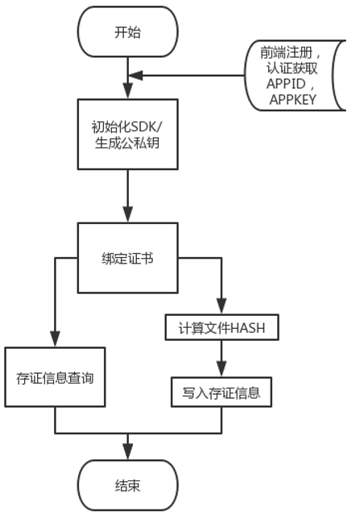

## 1. 文档描述

### 1.1. 功能描述

本文档用于描述至信链 GO SDK  所提供的方法及如何通过 GO SDK 接入至信链司法存证服务

### 1.2. 文档历史

| 修订日期   | 修订内容 | 修订版本 |
| ---------- | -------- | -------- |
| 2020.08.11 | 新增接口 | 2.0.1    |
| 2021.01.28 | 新增代理商相关接口 | 2.0.4    |

### 1.3. 阅读对象

接入至信链的开发者

## 2. 接口简介

### 2.1 协议规则

| 分类     | 说明                            |
| -------- | ------------------------------- |
| 传输方式 | 为保证传输安全，采用 HTTPS 传输 |
| 数据格式 | 参考具体方法定义                |

### 2.2 接口清单

| 接口                                                         | 说明                                               |
| ------------------------------------------------------------ | -------------------------------------------------- |
| NewZxlImpl(appId, appKey string) (*zxlImpl, error)           | SDK 初始化                                         |
| GenerateKeyPair() (pk string, sk string, err error)          | 生成公私钥                                         |
| BindUserCert(pk, sk string, timeout time.Duration) error     | 绑定证书                                           |
| UpdateUserCert(pk, sk string, timeout time.Duration) error   | 更新证书                                           |
| CalculateHash(path string) (string, error)                   | 计算文件 HASH                                      |
| EvidenceSave(evHash, extendInfo, sk, pk string, timeout time.Duration) (*EvSaveResult, error) | 写入存证信息                                       |
| QueryWithEvId(evId string, timeout time.Duration) ([]QueryResp, error) | 根据证据 ID 查询存证信息                           |
| QueryWithTxHash(txHash string, timeout time.Duration) ([]QueryResp, error) | 根据交易 HASH 查询存证信息                         |
| QueryWithEvHash(evHash string, timeout time.Duration) ([]QueryResp, error) | 根据证据 HASH 查询存证 信息                        |
| QueryWithHash(hash string, timeout time.Duration) ([]QueryResp, error) | 不明确指定，可以是   txHash,evId,evHash 中任意一个 |
| ContentCaptureVideo(webUrls string, timeout time.Duration) (string, error) | 下发录屏任务到取证工具服务                         |
| ContentCapturePic(webUrls string, timeout time.Duration) (string, error) | 下发截屏任务到取证工具服务                         |
| GetContentStatus(orderNo string, timeout time.Duration) (*TaskEvData, error) | 根据orderNo查询截屏/录屏任务状态                   |
| EvidenceObtainVideo(webUrls, title, remark, representAppId string, timeout time.Duration) (string, error) | 视频取证接口                                       |
| EvidenceObtainPic(webUrls, title, remark, representAppId string, timeout time.Duration) (string, error) | 图片取证                                           |
| GetEvidenceStatus(orderNo, appId string, timeout time.Duration) (*EvIdData, error) | 查询取证结果                                       |
| RegisterUser(info AgentUser, timeout time.Duration) (bool, error) | 代理用户注册                                       |
| SelectEpInfo(email string, timeout time.Duration) (ReviewData, error) | 查询代理用户审核结果                                       |
| BindRepresentUserCert(representAppId, representAppKey, representPk, representSk string) (bool, error) | 上传代理用户的证书                                       |
| UpdateRepresentUserCert(representAppId, representAppKey, representPk, representSk string) (bool, error) | 更新代理用户证书                                       |
| RepresentSave(evHash, extendInfo, representSk, representAppId string, timeout time.Duration) (*EvSaveResult, error) | 代理商模式下的用户存证                                       |


## 3. 接入流程



### 3.1 获取 SDK

1. 进入到 go 根目录或者当前项目的 vendor 目录中的 github.com/zhixinlian目录下  
2. 运行命令 git clone https://github.com/zhixinlian/zxl-go-sdk.git  
3. 选择版本，tag：v2.0.1 

### 3.2 使用步骤
1. 通过至信链线上首页注册账户并完成认证，获取生成的 APPID 与 APPKEY;

2. 获取 SDK ，见 [3.1]()

3. 使用 NewZxlImpl 创建 SDK 实例

4. 使用 GenerateKeyPair 方法，生成公私钥对

5. 使用 BindUserCert 方法，绑定证书

6. 使用 CalculateHash 方法，计算需要存证的文件 HASH

7. 使用 EvidenceSave  方法，写入存证 HASH 信息

### 3.3 使用示例

```
package main

import (
	"fmt"
	zxl "github.com/zhixinlian/zxl-go-sdk"
)

func main() {
	//初始化应用
	zxl, err := zxl.NewZxlImpl("123456000110000", "appkey")
	if err != nil {
		panic(err)
	}

	//生成公私钥对
	pk, sk, err := zxl.GenerateKeyPair()
	if err != nil {
		panic(err)
	}
	fmt.Println("公钥:", pk)
	fmt.Println("私钥:", sk)
	
	// 绑定证书
	err = zxl.BindUserCert(pk, sk)
	if err != nil {
		t.Error(err)
	}
	//计算文件hash
	hashStr, err := zxl.CalculateHash("G:\\channel.zip")
	if err != nil {
		panic(err.Error())
	}
	fmt.Print(hashStr)
	
	// 写入存证信息
	result, err := zxl.EvidenceSave(hashStr, "extendInfo", sk, pk, 0)
	if err != nil {
		t.Error(err.Error())
	}
}
```


## 4. 方法定义
### 4.1. 创建 SDK 实例

* 方法原型

  ```
  NewZxlImpl(appId, appKey string) (*zxlImpl, error)
  ```

* 参数说明

  | 参数名 | 参数类型 | 默认值 | 参数描述   |
  | ------ | -------- | ------ | ---------- |
  | appId  | string   | 无     | 企业 APPID |
  | appKey | string   | 无     | 企业APPKEY |

* 返回值

  | 返回值类型 | 返回值描述 |
  | ---------- | ---------- |
  | NewZxlImpl | SDK 实例   |

### 4.2 证书绑定

* 方法原型

  ```
  GenerateKeyPair() (pk string, sk string, err error)
  ```

* 参数说明

  | 参数名 | 参数类型 | 默认值 | 参数描述 |
  | ------ | -------- | ------ | -------- |
  | pk     | string   |        | 公钥     |
  | sk     | string   |        | 私钥     |

* 返回值

  -

### 4.3 计算文件 HASH

* 方法原型

  ```
  CalculateHash(path string) (string, error)
  ```

* 参数说明
  | 参数名 | 参数类型 | 默认值 | 参数描述 |
  | ------ | -------- | ------ | -------- |
  | path   | string   |        | 文件路径 |

* 返回值

  | 返回值类型 | 返回值描述                |
  | ---------- | ------------------------- |
  | string     | 指定文件 SM3 算法后的散列 |


### 4.4 写入存证信息

* 方法原型

  ```
  EvidenceSave(evHash, extendInfo, sk, pk string, timeout time.Duration) (*EvSaveResult, error)
  ```

* 参数说明

  | 参数名     | 参数类型      | 默认值 | 参数描述                  |
  | ---------- | ------------- | ------ | ------------------------- |
  | evHash     | string        |        | 证据 HASH，length <= 1024 |
  | extendInfo | string        |        | 扩展信息                  |
  | sk         | string        |        | 私钥                      |
  | pk         | string        |        | 公钥                      |
  | timeout    | time.Duration |        | 超时时间                  |

* 返回值

  | 返回值类型   | 返回值描述                                                   |
  | ------------ | ------------------------------------------------------------ |
  | EvSaveResult | {<br />"evId":"记链唯一标识",<br />"txHash":"交易hash",<br />"createTime": "出块时间",<br />"ext": "扩展信息，可通过 key ： queryCertUrl,获取证书"<br />} |

  ```
  type EvSaveResult struct {
  	BlockHeight int64  `json:"blockHeight"`
  	EvId        string `json:"evId"`
  	TxHash      string `json:"txHash"`
  	EvHash      string `json:"evHash"`
  	CreateTime  string `json:"createTime"`
  	Ext         string `json:"ext"`
  }
  ```

  

### 4.4 查询存证信息

* 方法原型

  - ```
    QueryWithEvHash(evHash string, timeout time.Duration) ([]QueryResp, error)
    ```
  - ```
    QueryWithHash(hash string, timeout time.Duration) ([]QueryResp, error)
    ```
  - ```
     QueryWithTxHash(txHash string, timeout time.Duration) ([]QueryResp, error)
    ```
  - ```
    QueryWithEvId(evId string, timeout time.Duration) ([]QueryResp, error)
    ```

* 参数说明

  | 参数名  | 参数类型      | 默认值 | 参数描述                                       |
  | ------- | ------------- | ------ | ---------------------------------------------- |
  | evHash  | string        |        | 存证 hash                                      |
  | txHash  | string        |        | 交易 hash                                      |
  | evId    | string        |        | 存证 id                                        |
  | hash    | string        |        | 不明确指定，可以是txHash,evId,evHash中任意一个 |
  | timeout | time.Duration |        | 超时时间                                       |

* 返回值

  | 返回值类型   | 返回值描述                                                   |
  | ------------ | ------------------------------------------------------------ |
  | EvSaveResult | {<br />"appId":"应用ID",<br />"evId":"记链唯一标识",<br />"evHash":"证据hash",<br />"txHash":"交易hash",<br />"extendInfo":"扩展信息",<br />"createTime": "出块时间",<br />"blockHeight": "区块高度",<br />"ext": "扩展信息，可通过 key ： queryCertUrl,获取证书"<br />} |

### 4.5 下发录屏/截屏任务到取证工具服务

* 方法原型

  * ```
    ContentCaptureVideo(webUrls string, timeout time.Duration) (string, error)
    ```

  * ```
    ContentCapturePic(webUrls string, timeout time.Duration) (string, error)
    ```

* 参数说明

  | 参数名  | 参数类型      | 默认值 | 参数描述      |
  | ------- | ------------- | ------ | ------------- |
  | webUrls | string        |        | 需要截屏的url |
  | timeout | time.Duration |        | 超时时间      |

* 返回值

  具体的orderNo（任务单号）

### 4.6 查询录屏/截屏任务状态及结果

* 方法原型

  * ```
    GetContentStatus(orderNo string, timeout time.Duration) (*TaskEvData, error)
    ```

* 参数说明

  | 参数名  | 参数类型      | 默认值 | 参数描述                          |
  | ------- | ------------- | ------ | --------------------------------- |
  | orderNo | string        |        | 截屏/录屏任务下发后返回的任务单号 |
  | timeout | time.Duration |        | 超时时间                          |

* 返回值

  | 返回值类型 | 返回值描述                                                   |
  | ---------- | ------------------------------------------------------------ |
  | TaskEvData | {<br />"status":"当前任务状态[0:执行中>>2成功>>10失败]",<br />"statusMsg":"任务状态解读:[运行中]>>[运行成功]>>[运行失败]",<br />"url":"状态成功时,对应的cosurl",<br />"hash":"截图成功时,对应的存证hash"<br />} |

### 4.7 视频/图片取证

* 方法原型

  * ```
    //视频取证接口
    EvidenceObtainVideo(webUrls, title, remark, representAppId string, timeout time.Duration) (string, error)
    ```

  * ```
    //图片取证
    EvidenceObtainPic(webUrls, title, remark, representAppId string, timeout time.Duration) (string, error)
    ```

* 参数说明

  | 参数名  | 参数类型     | 默认值 | 参数描述  |
  | ------- | ------------ | ------ | --------- |
  | webUrls | string       |        | 取证的url |
  | title   | string       |        | 标题      |
  | remark  | string       |        | 描述      |
  | representAppId  | string       |        | 代理用户id，传入""时则表示代理商本身做存取证      |
  | timeout | time.Duration |        | 超时时间  |

* 返回值

  具体的orderNo（任务单号）

### 4.8 查询取证结果

* 方法原型

  * ```
    GetEvidenceStatus(orderNo, appId string, timeout time.Duration) (*EvIdData, error)
    ```

* 参数说明

  | 参数名  | 参数类型      | 默认值 | 参数描述           |
  | ------- | ------------- | ------ | ------------------ |
  | orderNo | string        |        | 取证返回的任务单号 |
  | appId | string        |        | 可为代理商id或代理用户id |
  | timeout | time.Duration |        | 超时时间           |

* 返回值

  | 返回值类型 | 返回值描述                                                   |
  | ---------- | ------------------------------------------------------------ |
  | EvIdData   | {<br />"status":"当前任务状态[0:执行中>>2成功>>10失败]",<br />"evidUrl":"成功状态下,取证证据下载地址",<br />"voucherUrl":"成功状态下,取证证书下载地址"<br />} |
  
### 4.9 代理用户注册

* 方法原型

  * ```
    RegisterUser(info AgentUser, timeout time.Duration) (bool, error)
    ```

* 参数说明

  | 参数名  | 参数类型      | 默认值 | 参数描述           |
  | ------- | ------------- | ------ | ------------------ |
  | info | AgentUser        |        | 注册用户信息 |
  | timeout | time.Duration |        | 超时时间           |
  接口参数传入`AgentUser`类型对象：

  | *参数名*        | *参数类型* | *默认值* | *是否必填* | *参数描述*         |
  | --------------- | ---------- | -------- | ---------- | ------------------ |
  | RepresentEmail  | string     | 无       | 是         | 代理企业注册邮箱     |
  | Pwd             | string     | 无       | 是         | 代理企业注册密码  |
  | EpName          | string     | 无       | 是         | 代理企业名称           |
  | CreditCode      | string     | 无       | 是         | 代理企业信用代码       |
  | LicenseFile     | String       | 无       | 是         | 代理企业营业执照图片路径       |
  | Representative  | String     | 无       | 是         | 代理企业法人代表姓名           |
  | LetterFile      | String       | 无       | 否         | 至信链委托公函图片路径       |
  | Category        | int | 无       | 否         | 代理企业行业信息，枚举     |
  | Contact         | String     | 无       | 是         | 联系人姓名         |
  | Title           | String     | 无       | 否         | 联系人职位         |
  | Mobile          | String     | 无       | 是         | 联系人手机号       |
  | Idcard          | String     | 无       | 是         | 联系人身份证号码         |
  | CardFrontFile   | String       | 无       | 是         | 联系人身份证正面图片路径     |
  | CardBackendFile | String       | 无       | 是         | 联系人身份证反面图片路径     |
  ​     
* 返回值

  | 返回值类型 | 返回值描述                                                   |
  | ---------- | ------------------------------------------------------------ |
  | bool   | 注册成功与否，成功true，失败抛出对应异常信息|
  
### 4.10 查询代理用户审核结果

* 方法原型

  * ```
    SelectEpInfo(email string, timeout time.Duration) (ReviewData, error)
    ```

* 参数说明

  | *参数名* | *参数类型* | *默认值* | *是否必填* | *参数描述*                 |
  | -------- | ---------- | -------- | ---------- | -------------------------- |
  | email    | string     | 无       | 是         | 代理用户注册账户的邮箱账号 |
  | timeout | time.Duration |        | 超时时间           |
  ​     
* 返回值

  返回`ReviewData`类型对象：

  | 字段      | 类型   | 描述                                                         |
  | --------- | ------ | ------------------------------------------------------------ |
  | AppId     | string | 应用Id,当前字段的意义取决于state字段                         |
  | AppKey    | string | 应用key                                                      |
  | State     | int    | 认证是否通过：[1:待审核 2:认证通过 3:认证不通过]，状态值为2时appId字段才有意义 |
  | Reason    | string | 认证不通过的原因，若通过则为空串                             |
  | AgentCode | string | 代理商代码，仅在用户是代理商时才有意义                       |
  
### 4.11 上传代理用户的证书

* 方法原型

  * ```
    BindRepresentUserCert(representAppId, representAppKey, representPk, representSk string) (bool, error)
    ```

* 参数说明

  | *参数名*        | *参数类型* | *默认值* | *是否必填* | *参数描述*         |
  | --------------- | ---------- | -------- | ---------- | ------------------ |
  | representAppId  | string     | 无       | 是         | 代理用户appId      |
  | representAppKey | string     | 无       | 是         | 代理用户appKey     |
  | representPk     | string     | 无       | 是         | 代理用户生成的公钥 |
  | representSk     | string     | 无       | 是         | 代理用户生成的私钥 |
  | timeout | time.Duration |        | 超时时间           |
  ​     
* 返回值

  | 返回值类型 | 返回值描述                                                   |
  | ---------- | ------------------------------------------------------------ |
  | bool   | 上传结果，成功true，失败false|
  
### 4.12 更新代理用户证书

* 方法原型

  * ```
    BindRepresentUserCert(representAppId, representAppKey, representPk, representSk string) (bool, error)
    ```

* 参数说明

  | *参数名*        | *参数类型* | *默认值* | *是否必填* | *参数描述*         |
  | --------------- | ---------- | -------- | ---------- | ------------------ |
  | representAppId  | string     | 无       | 是         | 代理用户appId      |
  | representAppKey | string     | 无       | 是         | 代理用户appKey     |
  | representPk     | string     | 无       | 是         | 代理用户生成的公钥 |
  | representSk     | string     | 无       | 是         | 代理用户生成的私钥 |
  | timeout | time.Duration |        | 超时时间           |
  ​     
* 返回值

  | 返回值类型 | 返回值描述                                                   |
  | ---------- | ------------------------------------------------------------ |
  | bool   | 更新结果，成功true，失败false|
  
### 4.13 代理商模式下的用户存证

* 方法原型

  * ```
    RepresentSave(evHash, extendInfo, representSk, representAppId string, timeout time.Duration) (*EvSaveResult, error)
    ```

* 参数说明

  | *参数名*       | *参数类型* | *默认值* | *是否必填* | *参数描述*                         |
  | -------------- | ---------- | -------- | ---------- | ---------------------------------- |
  | evHash         | string     | 无       | 是         | 存证hash                           |
  | extendInfo     | string     | 无       | 是         | 拓展信息                           |
  | representSk    | string     | 无       | 是         | 代理用户私钥（用于对上链数据签名） |
  | representPk    | string     | 无       | 是         | 代理用户公钥                       |
  | representAppId | string     | 无       | 是         | 代理用户的应用id                   |
  | timeout | time.Duration |        | 超时时间           |
  ​     
* 返回值

  返回`EvSaveResult`类型对象，`EvSaveResult`对象说明：

  | 字段        | 类型   | 描述     |
  | ----------- | ------ | -------- |
  | EvId        | string | 存证Id   |
  | TxHash      | string | 交易hash |
  | BlockHeight | string | 区块高度 |
  | CreateTime  | string | 创建时间 |
  | Ext         | string | 扩展信息 |
