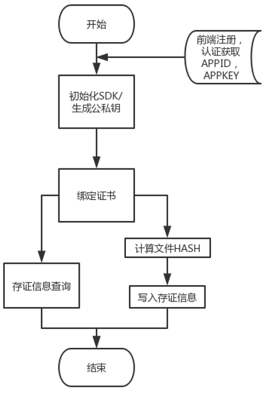

# 接口文档介绍

## 文档描述

本文档描述了至信链 GO SDK  所提供的所有功能及通过 GO SDK 调用至信链司法存证服务的方法

### 文档历史

| 修订日期   | 修订内容 | 修订版本 |
| ---------- | -------- | -------- |
| 2020.08.11 | 新增接口 | v2.0.1   |
| 2021.01.28 | 新增代理商相关接口 | v2.0.4   |
| 2021.02.09 | 增加个人用户及确权接口 | v2.1.3 |
| 2021.05.12 | 接口优化            | v2.1.4 |
| 2021.06.10 | 新增长视频录屏支持            | v2.1.4.4 |
| 2021.10.25 | SDK 重构            | v2.3.0 |
| 2021.11.03 | 支持云桌面取证            | v2.3.2 |
| 2021.12.10 | go module 升级到 v2      | v2.3.3 |


### 阅读对象

接入至信链的开发者

### 协议规则

| 分类     | 说明                            |
| -------- | ------------------------------- |
| 传输方式 | 为保证传输安全，采用 HTTPS 传输 |
| 数据格式 | 参考具体方法定义                |


## 接入流程




# 鉴权绑定

## 获取 SDK


```shell
$ go get -u github.com/zhixinlian/zxl-go-sdk/v2@v2.3.3  
```


### 使用步骤
1. 通过至信链线上首页注册账户并完成认证，获取生成的 APPID 与 APPKEY;

2. 获取 SDK

3. 使用 NewZxlImpl 创建 SDK 实例

4. 使用 GenerateKeyPair 方法，生成公私钥对

5. 使用 BindUserCert 方法，绑定证书

6. 使用 CalculateHash 方法，计算需要存证的文件 HASH

7. 使用 EvidenceSave  方法，写入存证 HASH 信息

### 使用示例

```
package main

import (
	"fmt"
	zxl "github.com/zhixinlian/zxl-go-sdk"
)

func main() {
	//初始化应用
	zxl, err := zxl.NewZxlImpl("123456000110000", "appkey")
	if err != nil {
		panic(err)
	}

	//生成公私钥对
	pk, sk, err := zxl.GenerateKeyPair()
	if err != nil {
		panic(err)
	}
	fmt.Println("公钥:", pk)
	fmt.Println("私钥:", sk)
	
	// 绑定证书
	err = zxl.BindUserCert(pk, sk, 5 * time.Second)
	if err != nil {
		t.Error(err)
	}
	//计算文件hash
	hashStr, err := zxl.CalculateHash("G:\\channel.zip")
	if err != nil {
		panic(err.Error())
	}
	fmt.Print(hashStr)
	
	// 写入存证信息
	result, err := zxl.EvidenceSave(hashStr, "extendInfo", sk, pk, 0)
	if err != nil {
		t.Error(err.Error())
	}
}
```


## 创建 SDK 实例

* 方法原型

  ```
  NewZxlImpl(appId, appKey string) (*zxlImpl, error)
  ```

* 参数说明

  | 参数名 | 参数类型 | 默认值 | 参数描述   |
  | ------ | -------- | ------ | ---------- |
  | appId  | string   | 无     | 企业 APPID |
  | appKey | string   | 无     | 企业APPKEY |

* 返回值

  | 返回值类型 | 返回值描述 |
  | ---------- | ---------- |
  | NewZxlImpl | SDK 实例   |


## 证书绑定

* 方法原型

  ```
  BindUserCert(pk, sk string, timeout time.Duration) error
  ```

* 参数说明

  | 参数名 | 参数类型 | 默认值 | 参数描述 |
  | ------ | -------- | ------ | -------- |
  | pk     | string   |        | 公钥     |
  | sk     | string   |        | 私钥     |

* 返回值

  -

# hash 存证

## 计算文件 HASH

* 方法原型

  ```
  CalculateHash(path string) (string, error)
  ```

* 参数说明
  | 参数名 | 参数类型 | 默认值 | 参数描述 |
  | ------ | -------- | ------ | -------- |
  | path   | string   |        | 文件路径 |

* 返回值

  | 返回值类型 | 返回值描述                |
  | ---------- | ------------------------- |
  | string     | 指定文件 SM3 算法后的散列 |


## 数据上链存证

* 方法原型

  ```
  EvidenceSave(evHash, extendInfo, sk, pk string, timeout time.Duration) (*EvSaveResult, error)
  ```

* 参数说明

  | 参数名     | 参数类型      | 默认值 | 参数描述                  |
  | ---------- | ------------- | ------ | ------------------------- |
  | evHash     | string        |        | 证据 HASH，length <= 1024 |
  | extendInfo | string        |        | 扩展信息                  |
  | sk         | string        |        | 私钥                      |
  | pk         | string        |        | 公钥                      |
  | timeout    | time.Duration |        | 超时时间                  |

* 返回值

  | 返回值类型   | 返回值描述                                                   |
  | ------------ | ------------------------------------------------------------ |
  | EvSaveResult | {<br />"evId":"记链唯一标识",<br />"txHash":"交易hash",<br />"createTime": "出块时间",<br />"ext": "扩展信息，可通过 key ： queryCertUrl,获取证书"<br />} |

  ```
  type EvSaveResult struct {
  	BlockHeight int64  `json:"blockHeight"`
  	EvId        string `json:"evId"`
  	TxHash      string `json:"txHash"`
  	EvHash      string `json:"evHash"`
  	CreateTime  string `json:"createTime"`
  	Ext         string `json:"ext"`
  }
  ```

  

## 链上信息查询

* 方法原型

  - ```
    QueryWithEvHash(evHash string, timeout time.Duration) ([]QueryResp, error)
    ```
  - ```
    QueryWithHash(hash string, timeout time.Duration) ([]QueryResp, error)
    ```
  - ```
     QueryWithTxHash(txHash string, timeout time.Duration) ([]QueryResp, error)
    ```
  - ```
    QueryWithEvId(evId string, timeout time.Duration) ([]QueryResp, error)
    ```

* 参数说明

  | 参数名  | 参数类型      | 默认值 | 参数描述                                       |
  | ------- | ------------- | ------ | ---------------------------------------------- |
  | evHash  | string        |        | 存证 hash                                      |
  | txHash  | string        |        | 交易 hash                                      |
  | evId    | string        |        | 存证 id                                        |
  | hash    | string        |        | 不明确指定，可以是txHash,evId,evHash中任意一个 |
  | timeout | time.Duration |        | 超时时间                                       |

* 返回值

  | 返回值类型   | 返回值描述                                                   |
  | ------------ | ------------------------------------------------------------ |
  | EvSaveResult | {<br />"appId":"应用ID",<br />"evId":"记链唯一标识",<br />"evHash":"证据hash",<br />"txHash":"交易hash",<br />"extendInfo":"扩展信息",<br />"createTime": "出块时间",<br />"blockHeight": "区块高度",<br />"ext": "扩展信息，可通过 key ： queryCertUrl,获取证书"<br />} |


# 视频/图片/云桌面取证

## 视频/图片取证服务

* 方法原型

  * ```
    //视频取证接口
    EvidenceObtainVideo(webUrls, title, remark, timeout time.Duration) (string, error)
    ```

  * ```
    //图片取证
    EvidenceObtainPic(webUrls, title, remark, timeout time.Duration) (string, error)
    ```

* 参数说明

  | 参数名  | 参数类型     | 默认值 | 参数描述  |
  | ------- | ------------ | ------ | --------- |
  | webUrls | string       |        | 取证的url |
  | title   | string       |        | 标题      |
  | remark  | string       |        | 描述      |
  | timeout | time.Duration |        | 超时时间  |

* 返回值

  具体的orderNo（任务单号）


* 方法原型
  * ```
    //长视频取证接口
    NewEvidenceObtainVideo(obtainVideoOption *ObtainVideoOption, timeout time.Duration)
    ```
  
* 参数说明

  | 参数名  | 参数类型     | 默认值 | 参数描述  |
    | ------- | ------------ | ------ | --------- |
  | obtainVideoOption | *ObtainVideoOption       |        | 视频取证的参数 |
  | timeout | time.Duration |        | 超时时间  |
  obtainVideoOption的结构体如下

  | 参数名  | 参数类型     | 默认值 | 参数描述  |
      | ------- | ------------ | ------ | --------- |
  | webUrls | string       |        | 取证的url |
  | title   | string       |        | 标题      |
  | remark  | string       |        | 描述      |
  | duration | int |        | 录屏时间，单位:秒，不超过1小时|


* 返回值

  具体的orderNo（任务单号）

## 云桌面取证服务
* 方法原型

  * ```
    //云桌面取证
    EvidenceObtainCvd(title, remark, timeout time.Duration) (*TxRetDetail, error)
    ```

* 参数说明

  | 参数名  | 参数类型     | 默认值 | 参数描述  |
    | ------- | ------------ | ------ | --------- |
  | title   | string       |        | 标题      |
  | remark  | string       |        | 描述      |
  | timeout | time.Duration |        | 超时时间  |

* 返回值
    TxRetDetail的结构体如下

    | 参数名  | 参数类型     | 默认值 | 参数描述  |
    | ------- | ------------ | ------ | --------- |
    | orderNo | string       |        | 任务单号 |
    | msg   | string       |        | 云桌面调起登录信息      |

* 方法原型

  * ```
    //云桌面取证接口
    NewEvidenceObtainCvd(obtainVideoOption *ObtainVideoOption, timeout time.Duration)
    ```
* 参数说明

  | 参数名  | 参数类型     | 默认值 | 参数描述  |
        | ------- | ------------ | ------ | --------- |
  | obtainVideoOption | *ObtainVideoOption       |        | 取证参数 |
  | timeout | time.Duration |        | 超时时间  |
  obtainVideoOption的结构体如下

  | 参数名  | 参数类型     | 默认值 | 参数描述  |
          | ------- | ------------ | ------ | --------- |
  | title   | string       |        | 标题      |
  | remark  | string       |        | 描述      |


* 返回值

  TxRetDetail的结构体如下

  | 参数名  | 参数类型     | 默认值 | 参数描述  |
      | ------- | ------------ | ------ | --------- |
  | orderNo | string       |        | 任务单号 |
  | msg   | string       |        | 云桌面调起登录信息      |


## 查询取证结果

* 方法原型

  * ```
    GetEvidenceStatus(orderNo, timeout time.Duration) (*EvIdData, error)
    ```

* 参数说明

  | 参数名  | 参数类型      | 默认值 | 参数描述           |
  | ------- | ------------- | ------ | ------------------ |
  | orderNo | string        |        | 取证返回的任务单号 |
  | timeout | time.Duration |        | 超时时间           |

* 返回值

  | 返回值类型 | 返回值描述                                                   |
  | ---------- | ------------------------------------------------------------ |
  | EvIdData   | {<br />"status":"当前任务状态[0:执行中>>2成功>>10失败]",<br />"evidUrl":"成功状态下,取证证据下载地址",<br  />"voucherUrl":"成功状态下,取证证书下载地址",<br />"duration":"成功状态下,云桌面取证证据时长"<br />} |

* 示例
  ```go
      zxlsdk, err := zxl.NewZxlImpl(appId, appKey)
      if err != nil {
          panic(err)
      }
  
      obtainVideoOption := zxl.ObtainVideoOption{
          Duration:       3600,
          RepresentAppId: "",
          Remark:         "测试视频",
          Title:          "测试视频",
          WebUrls:        "https://zhixinliantest-1302317679.cos.ap-guangzhou.myqcloud.com/20210611/video/2021-06-11_15-15-18_655459332949.mp4",
      }
      //长视频取证
      orderNo, err := zxlsdk.NewEvidenceObtainVideo(&obtainVideoOption, 5*time.Second)
  
      if err != nil {
          fmt.Println(err)
          return
      }
      fmt.Printf("取证请求提交，订单号：%s\n", orderNo)
  
      evIdData := &zxl.EvIdData{}
  
      // 查询取证结果
      for {
          evIdData, err = zxlsdk.GetEvidenceStatus(orderNo, 0)
          if err != nil {
              panic(err)
          }
          fmt.Printf("evIdData is %v\n", evIdData)
          if evIdData.Status != 0 {
              break
          }
  
          time.Sleep(1 * time.Second)
  
      }
  ```

# 侵权监控服务

## 创建侵权监控任务

* 方法原型

  ```go
  SubmitTortTask(tort Tort, timeout time.Duration) (TortResp, error)
  ```

* 参数说明

  | *参数名* | *参数类型*    | *默认值* | *是否必填* | *参数描述*   |
  | -------- | ------------- | -------- | ---------- | ------------ |
  | tort     | Tort          | 无       | 是         | 侵权监控参数 |
  | timeOut  | time.Duration | 无       | 是         | 超时时间     |


Tort 结构如下:

| *参数名*  | *参数类型*           | *默认值* | *是否必填* | *参数描述*                                       |
| --------- | -------------------- | -------- | ---------- | ------------------------------------------------ |
| Url       | string               | 无       | 是         | 资源 url                                         |
| Title     | string               | 无       | 是         | 标题                                             |
| Keyword   | string               | 无       | 否         | 关键字列表，半角分号（;）分割                    |
| Type      | constants.TortType   | 无       | 是         | 资源类型                                         |
| Source    | constants.TortSource | 无       | 是         | 数据来源                                         |
| StartDate | string               | 无       | 否         | 开始时间（2006-01-02），如果不填，从当前时间开始 |
| EndDate   | string               | 无       | 是         | 结束时间（2006-01-02）                           |

* 枚举类型说明

  TortType（资源类型）：

  | 编码 | 常量           | 备注     |
  | ---- | -------------- | -------- |
  | 1    | MATERIAL_PHOTO | 图片类型 |
  | 2    | MATERIAL_TEXT  | 文字类型 |
  | 3    | MATERIAL_VIDEO | 视频类型 |

  TortSource（数据来源）：

  | 编码 | 常量        | 备注                         |
  | ---- | ----------- | ---------------------------- |
  | 1    | PROPERTY    | 房产类监测，type为图片时可用 |
  | 2    | ANY         | 原创类监测，type为图片时可用 |
  | 21   | SHORT_VIDEO | 短视频监测，type为视频时可用 |
  | 22   | LONG_VIDEO  | 长对短监测:监测范围和短视频一样，type 为长视频时可用 |
  | 23   | LONG_TO_LONG_VIDEO  | 长对长监测:全网视频小网站，type为视频时可用 |
  | 41   | NEWS_TEXT   | 新闻咨询类，监测范围全网   |

* 返回数据（TortResp）

  | 字段      | 类型   | 描述        |
  | --------- | ------ | ----------- |
  | TaskId    | string | 确权任务 Id |
  | RequestId | string | 请求Id      |

* 示例
    ```go
    zxlSDK, err := zxl_go_sdk.NewZxlImpl(appId, appKey)
    if err != nil {
      fmt.Println("初始化 SDK 错误")
      return
    }
    
    tort := zxl_go_sdk.Tort{
      Url: "https://inews.gtimg.com/newsapp_bt/0/5001rcns97nr04er/1000?appid=ee22ce76657290e1",
      Title: "测试图片",
      Keyword: "月亮;太空",
      Type: constants.MATERIAL_PHOTO,
      Source: constants.ANY_PIC,
      StartDate: "2021-03-31",
      EndDate: "2021-04-10",
    }
    
    resp, err := zxlSDK.SubmitTortTask(tort, 5 * time.Second)
    ```


## 查看监控任务结果

* 方法原型

  ```go
  QueryTortTaskResult(tortQuery TortQuery, timeout time.Duration) (TortQueryResp, error)
  ```

* 参数说明

  | *参数名*  | *参数类型*    | *默认值* | *是否必填* | *参数描述* |
  | --------- | ------------- | -------- | ---------- | ---------- |
  | tortQuery | TortQuery     | 无       | 是         | 查询参数   |
  | timeOut   | time.Duration | 无       | 是         | 超时时间   |

TortQuery 结构如下：

| *参数名* | *参数类型* | *默认值* | *是否必填* | *参数描述* |
| -------- | ---------- | -------- | ---------- | ---------- |
| TaskId   | string     | 无       | 是         | 任务Id     |
| Offset   | int        | 0       | 否         | 侵权线索列表起始位置，默认为 0 |
| Limit    | int        | 无       | 否        | 每次返回侵权线索列表数量，不填则表示返回全部 |

* 返回数据（TortQueryResp）

  | 字段      | 类型       | 描述         |
  | --------- | ---------- | ------------ |
  | ClueList  | []ClueData | 侵权线索列表   |
  | Count     | int        | 监测线索总数量 |
  | Status    | int        | 1：未开始，2：监测中 10: 已停止 |
  | RequestId | string     | 请求Id       |

ClueData 结构如下：

| 字段     | 类型   | 描述             |
| -------- | ------ | ---------------- |
| ClueId   | int    | 线索Id           |
| PlayUrl  | string | 侵权作品链接     |
| Title    | string | 侵权作品标题     |
| PubTime  | string | 侵权作品发布时间 |
| Platform | string | 侵权作品所属平台 |
| Author   | string | 侵权作品作者     |
| FindTime | string | 发现侵权时间     |


* 示例

  ```go
  zxlSDK, err := zxl_go_sdk.NewZxlImpl(appId, appKey)
  if err != nil {
    fmt.Println("初始化 SDK 错误")
    return
  }
  
  tortQuery := zxl_go_sdk.TortQuery{
    TaskId: "",
  }
  
  resp, err := zxlSDK.QueryTortTaskResult(tortQuery, 5 * time.Second)
  ```

  


 # 确权任务

## 发起数字版权确权请求

* 方法原型

  ```java
  SubmitDciClaim(dci DciClaim, timeout time.Duration) (DciClaimResp, error)
  ```

* 参数说明

  | *参数名* | *参数类型*    | *默认值* | *是否必填* | *参数描述* |
  | -------- | ------------- | -------- | ---------- | ---------- |
  | dciClaim | DciClaim      | 无       | 是         | 确权信息   |
  | timeOut  | time.Duration | 无       | 是         | 超时时间   |
  

 DciClaim 的结构如下：

| 参数名            | 参数类型          | 默认值 | 是否必填 | 参数描述                                 |
| ----------------- | ----------------- | ------ | -------- | ---------------------------------------- |
| DciName           | string            | 无     | 是       | 作品名字                                 |
| ProposerEmail     | string            | 无     | 是       | 申请人邮箱                               |
| ProposerSk        | string            | 无     | 是       | 申请人私钥                               |
| DciType           | DciType           | 无     | 是       | 作品类型（见下文 DciType）               |
| DciCreateProperty | DciCreateProperty | 无     | 是       | 作品创作属性（见下文 DciCreateProperty） |
| DciUrl            | string            | 无     | 是       | 作品url                                  |
| AuthorList        | []DciAuthor       | 无     | 是       | 作品作者信息                             |
| RightList         | []DciRight        | 无     | 是       | 权利人信息列表                           |

  AuthorList 结构如下：

| 参数名       | 参数类型   | 默认值 | 是否必填 | 备注                         |
| ------------ | ---------- | ------ | -------- | ---------------------------- |
| AuthorType   | AuthorType | 无     | 是       | 作者类型（见下文AuthorType） |
| AuthorName   | string     | 无     | 是       | 作者名字                     |
| AuthorIdCard | string     | 无     | 是       | 作者证件号                   |

  RightList 结构如下：

| 字段名          | 类型         | 默认值 | 是否必填 | 备注                        |
| --------------- | ------------ | ------ | -------- | --------------------------- |
| Type            | RightType    | 无     | 是       | 权利类型（见下文 RihtType） |
| RighterInfoList | []DciRighter | 无     | 是       | 权利人列表                  |

  DciRighter 结构如下：

| 字段名           | 类型        | 默认值 | 是否必填 | 备注                             |
| ---------------- | ----------- | ------ | -------- | -------------------------------- |
| RighterEmail     | string      | 无     | 是       | 权利人邮箱                       |
| RighterType      | RighterType | 无     | 是       | 权利人类型（见下文 RighterType） |
| RighterName      | string      | 无     | 是       | 权利人名字                       |
| RighterIdCard    | string      | 无     | 是       | 权利人证件号                     |
| RighterGainedWay | int         | 无     | 是       | 枚举获取途径                     |
| RighterSk        | string      | 无     | 是       | 权利人的私钥                     |

  

* 枚举类型说明

  DciType（作品类型）：

  | 编码 | 常量                 | 备注                         |
| ---- | -------------------- | ---------------------------- |
  | 1    | DCI_TYPE_TEXT        | 文字作品                     |
  | 2    | DCI_TYPE_MUSIC       | 音乐作品                     |
  | 3    | DCI_TYPE_ART_ARCH    | 美术或建筑作品               |
  | 4    | DCI_TYPE_FILMING     | 摄影作品                     |
  | 5    | DCI_TYPE_AUDIOVISUAL | 视听作品                     |
  | 6    | DCI_TYPE_PIC_MODEL   | 设计图或示意图等图形模型作品 |
  | 7    | DCI_TYPE_SOFTWARE    | 计算机软件                   |
  | 8    | DCI_TYPE_OTHER       | 符合作品特征的其他智力成果   |
  
  GainedWay（权利获取途径）：

  | 编码 | 常量                | 备注 |
  | ---- | ------------------- | ---- |
  | 1    | GAINED_WAY_ORIGINAL | 原始 |
  | 2    | GAINED_WAY_ACCEPT   | 承受 |
  | 3    | GAINED_WAY_INHERIT  | 继承 |
  | 4    | GAINED_WAY_OTHER    | 其他 |
  
  DciCreateProperty（作品创作属性）：
  
  | 编码 | 常量                           | 备注 |
  | ---- | ------------------------------ | ---- |
  | 1    | DCI_CREATE_PROPERTY_ORIGINAL   | 原创 |
  | 2    | DCI_CREATE_PROPERTY_ADAPT      | 改编 |
  | 3    | DCI_CREATE_PROPERTY_TRANSLATE  | 翻译 |
  | 4    | DCI_CREATE_PROPERTY_COLLECTION | 汇编 |
  | 5    | DCI_CREATE_PROPERTY_COMMENT    | 注释 |
  | 6    | DCI_CREATE_PROPERTY_TIDY       | 整理 |
  | 7    | DCI_CREATE_PROPERTY_OTHER      | 其他 |
  
  RightType（权利类型）：
  
  | 编码 | 常量                    | 备注           |
  | ---- | ----------------------- | -------------- |
  | 1    | RIGHT_TYPE_PUBLIC       | 发表权         |
  | 2    | RIGHT_TYPE_SIGN         | 署名权         |
  | 3    | RIGHT_TYPE_MODIFY       | 修改权         |
  | 4    | RIGHT_TYPE_FULL_PROTECT | 保护权         |
  | 5    | RIGHT_TYPE_COPY         | 复制权         |
  | 6    | RIGHT_TYPE_DISTRIBUTION | 发行权         |
  | 7    | RIGHT_TYPE_RENT         | 出租权         |
  | 8    | RIGHT_TYPE_DISPLAY      | 展览权         |
  | 9    | RIGHT_TYPE_SHOW         | 表演权         |
  | 10   | RIGHT_TYPE_PLAY         | 放映权         |
  | 11   | RIGHT_TYPE_BROADCAST    | 广播权         |
  | 12   | RIGHT_TYPE_NET_TRANS    | 信息网络传播权 |
  | 13   | RIGHT_TYPE_FILMING      | 摄制权         |
  | 14   | RIGHT_TYPE_ADAPT        | 改编权         |
  | 15   | RIGHT_TYPE_TRANSLATE    | 翻译权         |
  | 16   | RIGHT_TYPE_COLLECTION   | 汇编权         |
  | 17   | RIGHT_TYPE_OTHER        | 其他权利       |
  | 18   | RIGHT_TYPE_ALL          | 所有           |

  > 注意：当前只支持编号 18 的**所有**项，其他权利会在后续支持
  
  RighterType（权利人类型）：
  
  | 编码 | 常量                 | 备注   |
  | ---- | -------------------- | ------ |
  | 1    | RIGHTER_TYPE_NATURAL | 自然人 |
  | 2    | RIGHTER_TYPE_LEGAL   | 法人   |
  
  AuthorType（作者类型）：
  
  | 编码 | 常量                | 备注   |
  | ---- | ------------------- | ------ |
  | 1    | AUTHOR_TYPE_NATURAL | 自然人 |
  | 2    | AUTHOR_TYPE_LEGAL   | 法人   |


> DciClaim 的结构比较复杂，除了填充作品信息之外，还需要填充**权利项**（DciRight）和**作者**信息（DciAuthor），权利项中又包含**权利人**（DciRighter） 信息，具体用法看示例代码。
>
> 另外需要注意
>
> 1. 目前 DciRight 的 type 只能使用 RIGHT_TYPE_ALL 值
> 2. sk 是 dciClaim 中 proposerEmail 所属账户的私钥


* 返回数据 （DciClaimResp）

  | 字段   | 类型   | 描述        |
  | ------ | ------ | ----------- |
  | TaskId | String | 确权任务 Id |

* 示例

  ```go
  zxlSDK, err := zxl_go_sdk.NewZxlImpl(appId, appKey)
  	if err != nil {
  		fmt.Println("初始化 SDK 错误")
  	}
  
  	righter := zxl_go_sdk.DciRighter{
  		RighterName: "",
  		RighterIdCard: "",
  		RighterEmail: "",
  		RighterGainedWay: constants.GAINED_WAY_ORIGINAL,
  		RighterSk: sk,
  		RighterType: constants.RIGHTER_TYPE_LEGAL,
  	}
  
  	right := zxl_go_sdk.DciRight{
  		Type: constants.RIGHT_TYPE_ALL,
  		RighterInfoList: []zxl_go_sdk.DciRighter{righter},
  	}
  
  	author := zxl_go_sdk.DciAuthor{
  		AuthorName: "",
  		AuthorIdCard: "",
  		AuthorType: constants.AUTHOR_TYPE_LEGAL,
  	}
  
  	dciClaim := zxl_go_sdk.DciClaim{
  		DciName: "图片作品1",
  		DciUrl: "https://www.sina.com.cn/",
  		ProposerEmail: "",
        ProposerSk: sk,
  		DciType: constants.DCI_TYPE_FILMING,
  		DciCreateProperty: constants.DCI_CREATE_PROPERTY_ADAPT,
  		RightInfoList: []zxl_go_sdk.DciRight{right},
  		AuthorList: []zxl_go_sdk.DciAuthor{author},
  	}
  	resp, err := zxlSDK.SubmitDciClaim(dciClaim, 10 * time.Second)
  
  	if err != nil {
  		fmt.Printf("提交确权请求出错 %+v", err)
  		return
  	}
  ```


## 用户查询确权结果

* 方法原型

  ```java
  QueryDciClaimResult(dciQuery DciClaimQuery, timeout time.Duration) (DciClaimQueryResp, error)
  ```

* 参数说明（DciClaimQuery）

  | *参数名* | *参数类型* | *默认值* | *是否必填* | *参数描述* |
  | -------- | ---------- | -------- | ---------- | ---------- |
  | TaskId   | String     | 无       | 是         | 确权任务ID |


* 返回数据（DciClaimQueryResp）

  | 字段            | 类型         | 描述                                                         |
  | --------------- | ------------ | ------------------------------------------------------------ |
  | Status          | int          | 确权任务状态值（2 处理中，4 搜索出来的图片url，疑似侵权中止流程 7 成功, 10 失败） |
  | DciId           | string       | 确权 id                                                      |
  | Url             | string       | 证书地址                                                     |
  | TortSearchList  | []TortSearch | 如果作品发生侵权，就会返回被侵权的作品地址                   |
  | RecordTimestamp | int          | 确权时间戳                                                   |
  
  TortSearch 结构如下：
  
  | 字段 | 类型   | 描述           |
  | ---- | ------ | -------------- |
  | Url  | String | 被确权作品 url |

​       

* 示例

  ```java
  zxlSDK, err := zxl_go_sdk.NewZxlImpl(appId, appKey)
  if err != nil {
    fmt.Println("初始化 SDK 错误")
  }
  
  dciQuery := zxl_go_sdk.DciClaimQuery{
    TaskId: "2e845212-65b0-4b37-9770-d68394b5b8ee_5",
  }
  
  resp, err := zxlSDK.QueryDciClaimResult(dciQuery, 10 * time.Second)
  if err != nil {
    fmt.Printf("确权查询出错 %+v", err)
    return
  }
  ```
  
# Kv 服务

## Kv 存储

### 方法原型

````java
KvSave(req KvSaveReq, timeout time.Duration) (*KvSaveResp, error)
````

### 参数说明

| *参数名*  | *参数类型* | *默认值* | *是否必填* | *参数描述*                             |
| --------- | ---------- | -------- | ---------- | -------------------------------------- |
| req       | KvSaveReq     | 无       | 是         | kv 存储请求                               |
| timeout   | time.Duration | 无       | 是         |   请求超时时间       |

KvSaveReq 结构如下：
| *参数名*  | *参数类型* | *默认值* | *是否必填* | *参数描述*                             |
| --------- | ---------- | -------- | ---------- | -------------------------------------- |
| KvKey      | String     | 无       | 是         | kv 数据的 key                              |
| KvValue      | String     | 无       | 是         | kv 数据的 value                              |
| Sk      | String     | 无       | 是         | 存储人的私钥（如果是代理用户，就是代理用户的私钥）                             |
| RepresentAppId      | String     | 无       | 否         | 代理用户 appId                          |

> 注：KvKey 要使用 appId: 开始，如果是代理用户，就使用 representAppId: 开头，
> 例如 201107000400001:xxxxx

### 返回数据

| 字段   | 类型   | 描述    |
| ------ | ------ | ------- |
| resp | KvSaveResp | Kv 存储结果 |

KvSaveResp 结构如下：
| 字段   | 类型   | 描述    |
| ------ | ------ | ------- |
| KvKey | String | kv 的 key|
| RequestId | String | 请求的 requestId|

### 示例

```go

key := appId + ":" + ""

req := zxl_go_sdk.KvSaveReq{
    KvKey: key,
    KvValue: "",
    Sk: sK,
}

resp, err := sdk.KvSave(req, 5 * time.Second)
```


## 查询 Kv

### 方法原型

````java
KvQuery(req KvQueryReq, timeout time.Duration) (*KvQueryResp, error) 
````

### 参数说明

| *参数名* | *参数类型* | *默认值* | *是否必填* | *参数描述*                   |
| -------- | ---------- | -------- | ---------- | ---------------------------- |
| req   | KvQueryReq     | 无       | 是         | Kv 查询请求 |
| timeout   | time.Duration | 无       | 是         |   请求超时时间       |

KvQueryReq 结构如下：
| *参数名* | *参数类型* | *默认值* | *是否必填* | *参数描述*                   |
| -------- | ---------- | -------- | ---------- | ---------------------------- |
| KvKey   | String     | 无       | 是         | kv 数据的 key |

### 返回数据

| 字段           | 类型 | 描述             |
| -------------- | ---- | ---------------- |
| resp| KvQueryResp | kv 数据查询结果 |

KvQueryResp 结构如下：
| 字段           | 类型 | 描述             |
| -------------- | ---- | ---------------- |
| KvKey| String | kv 数据的 key |
| KvValue| String | kv 数据的 value |
| CreateTime| String | kv 数据上链时间 |
| Status| Integer | kv 数据状态（1：未上链，3：上链成功，4：上链失败） |
| RequestId| String | 请求 requestId |

### 示例

````java
key := ""
queryReq := zxl_go_sdk.KvQueryReq{
               KvKey: key,
            }
queryResp, err := sdk.KvQuery(queryReq, 5 * time.Second)

````


# 代理商服务


## 法人代理用户注册

* 方法原型

  * ```
    RegisterUser(agentUser AgentUser, timeout time.Duration) (bool, error)
    ```

* 参数说明

  | 参数名  | 参数类型      | 默认值 | 参数描述           |
  | ------- | ------------- | ------ | ------------------ |
  | agentUser | AgentUser        | 无 | 注册用户信息 |
  | timeout | time.Duration | 无 | 超时时间           |
  接口参数传入`AgentUser`类型对象：

  | *参数名*        | *参数类型* | *默认值* | *是否必填* | *参数描述*         |
  | --------------- | ---------- | -------- | ---------- | ------------------ |
  | RepresentEmail  | string     | 无       | 是         | 代理企业注册邮箱     |
  | Pwd             | string     | 无       | 是         | 代理企业注册密码  |
  | EpName          | string     | 无       | 是       | 代理企业名称           |
  | CreditCode      | string     | 无       | 是       | 代理企业信用代码       |
  | LicenseFile     | string      | 无       | 是       | 代理企业营业执照图片路径       |
  | Representative  | string    | 无       | 是       | 代理企业法人代表姓名           |
  | LetterFile      | string      | 无       | 否         | 至信链委托公函图片路径       |
  | Category        | int | 无       | 否         | 代理企业行业信息，枚举     |
  | Contact         | string    | 无       | 是         | 联系人姓名         |
  | Title           | string    | 无       | 否         | 联系人职位         |
  | Mobile          | string    | 无       | 是         | 联系人手机号       |
  | Idcard          | string    | 无       | 是         | 联系人身份证号码         |
  | CardFrontFile   | string      | 无       | 是         | 联系人身份证正面图片路径     |
  | CardBackendFile | string      | 无       | 是         | 联系人身份证反面图片路径     |
  | UserType | int | 无 | 是 | 用户类型，填入：1（法人） |
  | PlatformName | string | 无 | 否 | 接入平台名称 |
  | PlatformUrl | string | 无 | 否 | 接入平台地址 |
  | BusinessType | int | 4 | 否 | 平台业务类型 (1:金融类 2:版权类 3:其他类 4:未填写)，默认是未填写 |
  
  ​     
* 返回值

  | 返回值类型 | 返回值描述                                                   |
  | ---------- | ------------------------------------------------------------ |
  | bool   | 注册成功与否，成功true，失败抛出对应异常信息|
  
* 示例

  ```go
  
  // 企业用户注册
  zxlSDK, err := zxl_go_sdk.NewZxlImpl(appId, appKey)
  if err != nil {
    fmt.Println("初始化 SDK 错误")
  }
  
  user := zxl_go_sdk.AgentUser{
    EpName:          "XX集团有限公司",
    Pwd:             "123456aaa",
    RepresentEmail:  "zxin3@admin.com",
    Representative:  "XXX",
    CreditCode:      "914400002311176XXX",
    Contact:         "XXX",
    Idcard:          "140502197311051XXX",
    Mobile:          "18600213476",
    PlatformName:    "小说平台",
    PlatformUrl:     "https://www.xiaoshuo.com",
    BusinessType:    constants.BUSINESS_COPYRIGHT,
    UserType:        constants.USER_LEGAL_PERSON,
    CardFrontFile:   "/root/workspace/zx-demo/idcard_front.jpeg",
    CardBackendFile: "/root/workspace/zx-demo/idcard_front.jpeg",
    LicenseFile:     "/root/workspace/zx-demo/license.jpeg",
  }
  result, err := zxlSDK.RegisterUser(user, 5*time.Second)
  
  if err != nil {
    fmt.Println("注册用户错误: " + err.Error())
    return
  }
  
  ```


## 自然人代理用户注册

* 方法原型

  * ```
    RegisterUser(agentUser AgentUser, timeout time.Duration) (bool, error)
    ```

* 参数说明

  | 参数名    | 参数类型      | 默认值 | 参数描述     |
  | --------- | ------------- | ------ | ------------ |
  | agentUser | AgentUser     | 无     | 注册用户信息 |
  | timeout   | time.Duration | 无     | 超时时间     |

  接口参数传入`AgentUser`类型对象：

  | *参数名*        | *参数类型* | *默认值* | *是否必填* | *参数描述*                  |
  | --------------- | ---------- | -------- | ---------- | --------------------------- |
  | RepresentEmail  | string     | 无       | 是         | 代理用户注册邮箱            |
  | Pwd             | string     | 无       | 是         | 代理用户注册密码            |
  | PersonName      | string     | 无       | 是         | 代理用户姓名                |
  | Mobile          | string     | 无       | 是         | 联系人手机号                |
  | Idcard          | string     | 无       | 是         | 联系人身份证号码            |
  | CardFrontFile   | string     | 无       | 是         | 联系人身份证正面图片路径    |
  | CardBackendFile | string     | 无       | 是         | 联系人身份证反面图片路径    |
  | UserType        | int        | 无       | 是         | 用户类型，填入：2（自然人） |

  ​     

* 返回值

  | 返回值类型 | 返回值描述                                   |
  | ---------- | -------------------------------------------- |
  | bool       | 注册成功与否，成功true，失败抛出对应异常信息 |

* 示例

  ```go
  
  // 自然人用户注册
  zxlSDK, err := zxl_go_sdk.NewZxlImpl(appId, appKey)
  if err != nil {
    fmt.Println("初始化 SDK 错误")
  }
  
  user := zxl_go_sdk.AgentUser{
    PersonName:      "XXX",
    Pwd:             "123456aaa",
    RepresentEmail:  "zxin_person3@admin.com",
    Idcard:          "320681199209029XXX",
    Mobile:          "18600213476",
    UserType:        constants.USER_NATURAL_PERSON,
    CardFrontFile:   "/root/workspace/zx-demo/idcard_front.jpeg",
    CardBackendFile: "/root/workspace/zx-demo/idcard_front.jpeg",
  }
  result, err := zxlSDK.RegisterUser(user, 5*time.Second)
  
  if err != nil {
    fmt.Println("注册用户错误: " + err.Error())
    return
  }
  
  ```


## 查询代理用户审核结果

* 方法原型

  * ```
    SelectEpInfo(email string, timeout time.Duration) (ReviewData, error)
    ```

* 参数说明

  | *参数名* | *参数类型* | *默认值* | *是否必填* | *参数描述*                 |
  | -------- | ---------- | -------- | ---------- | -------------------------- |
  | email    | string     | 无       | 是         | 代理用户注册账户的邮箱账号 |
  | timeout | time.Duration |        | 超时时间           ||
  ​     
* 返回值

  返回`ReviewData`类型对象：

  | 字段      | 类型   | 描述                                                         |
  | --------- | ------ | ------------------------------------------------------------ |
  | AppId     | string | 应用Id,当前字段的意义取决于state字段                         |
  | AppKey    | string | 应用key                                                      |
  | State     | int    | 认证是否通过：[1:待审核 2:认证通过 3:认证不通过]，状态值为2时appId字段才有意义 |
  | Reason    | string | 认证不通过的原因，若通过则为空串                             |
  | AgentCode | string | 代理商代码，仅在用户是代理商时才有意义                       |
  


## 上传代理用户的证书

* 方法原型

  * ```
    BindRepresentUserCert(representAppId, representAppKey, representPk, representSk string) (bool, error)
    ```

* 参数说明

  | *参数名*        | *参数类型* | *默认值* | *是否必填* | *参数描述*         |
  | --------------- | ---------- | -------- | ---------- | ------------------ |
  | representAppId  | string     | 无       | 是         | 代理用户appId      |
  | representAppKey | string     | 无       | 是         | 代理用户appKey     |
  | representPk     | string     | 无       | 是         | 代理用户生成的公钥 |
  | representSk     | string     | 无       | 是         | 代理用户生成的私钥 |
  
  ​     
* 返回值

  | 返回值类型 | 返回值描述                                                   |
  | ---------- | ------------------------------------------------------------ |
  | bool   | 上传结果，成功true，失败false|
  


## 更新代理用户证书

* 方法原型

  * ```
    UpdateRepresentUserCert(representAppId, representAppKey, representPk, representSk string) (bool, error)
    ```

* 参数说明

  | *参数名*        | *参数类型* | *默认值* | *是否必填* | *参数描述*         |
  | --------------- | ---------- | -------- | ---------- | ------------------ |
  | representAppId  | string     | 无       | 是         | 代理用户appId      |
  | representAppKey | string     | 无       | 是         | 代理用户appKey     |
  | representPk     | string     | 无       | 是         | 代理用户生成的公钥 |
  | representSk     | string     | 无       | 是         | 代理用户生成的私钥 |
  
  ​     
* 返回值

  | 返回值类型 | 返回值描述                                                   |
  | ---------- | ------------------------------------------------------------ |
  | bool   | 更新结果，成功true，失败false|
  


## 代理商模式下的用户存证

* 方法原型

  * ```
    RepresentSave(evHash, extendInfo, representSk, representAppId string, timeout time.Duration) (*EvSaveResult, error)
    ```

* 参数说明

  | *参数名*       | *参数类型* | *默认值* | *是否必填* | *参数描述*                         |
  | -------------- | ---------- | -------- | ---------- | ---------------------------------- |
  | evHash         | string     | 无       | 是         | 存证hash                           |
  | extendInfo     | string     | 无       | 是         | 拓展信息                           |
  | representSk    | string     | 无       | 是         | 代理用户私钥（用于对上链数据签名） |
  | representPk    | string     | 无       | 是         | 代理用户公钥                       |
  | representAppId | string     | 无       | 是         | 代理用户的应用id                   |
  | timeout | time.Duration |        | 超时时间           |
  ​     
* 返回值

  返回`EvSaveResult`类型对象，`EvSaveResult`对象说明：

  | 字段        | 类型   | 描述     |
  | ----------- | ------ | -------- |
  | EvId        | string | 存证Id   |
  | TxHash      | string | 交易hash |
  | BlockHeight | string | 区块高度 |
  | CreateTime  | string | 创建时间 |
  | Ext         | string | 扩展信息 |

# 代理商模式下视频/图片/云桌面取证

## 代理商视频/图片取证服务

* 方法原型

  * ```
    //视频取证接口
    RepresentEvidenceObtainVideo(webUrls, title, remark, representAppId string, timeout time.Duration) (string, error)
    ```

  * ```
    //图片取证
    RepresentEvidenceObtainPic(webUrls, title, remark, representAppId string, timeout time.Duration) (string, error)
    ```

* 参数说明

  | 参数名  | 参数类型     | 默认值 | 参数描述  |
  | ------- | ------------ | ------ | --------- |
  | webUrls | string       |        | 取证的url |
  | title   | string       |        | 标题      |
  | remark  | string       |        | 描述      |
  | representAppId  | string       |        | 代理用户id，传入""时则表示代理商本身做存取证      |
  | timeout | time.Duration |        | 超时时间  |
  
* 返回值 

  具体的orderNo（任务单号）


* 方法原型
  * ```
    //长视频取证接口
    NewEvidenceObtainVideo(obtainVideoOption *ObtainVideoOption, timeout time.Duration)
    ```

* 参数说明

  | 参数名  | 参数类型     | 默认值 | 参数描述  |
      | ------- | ------------ | ------ | --------- |
  | obtainVideoOption | *ObtainVideoOption       |        | 视频取证的参数 |
  | timeout | time.Duration |        | 超时时间  |
  obtainVideoOption的结构体如下

  | 参数名  | 参数类型     | 默认值 | 参数描述  |
        | ------- | ------------ | ------ | --------- |
  | webUrls | string       |        | 取证的url |
  | title   | string       |        | 标题      |
  | representAppId  | string       |        | 代理用户id，传入""时则表示代理商本身做存取证      |
  | remark  | string       |        | 描述      |
  | duration | int |        | 录屏时间，单位:秒，不超过1小时|


* 返回值

  具体的orderNo（任务单号）

## 代理商云桌面取证服务

* 方法原型

  * ```
    //云桌面取证接口
    RepresentEvidenceObtainCvd(webUrls, title, remark, representAppId string, timeout time.Duration) (*TxRetDetail, error)
    ```

* 参数说明

  | 参数名  | 参数类型     | 默认值 | 参数描述  |
    | ------- | ------------ | ------ | --------- |
  | title   | string       |        | 标题      |
  | remark  | string       |        | 描述      |
  | representAppId  | string       |        | 代理用户id，传入""时则表示代理商本身做存取证      |
  | timeout | time.Duration |        | 超时时间  |

* 返回值

  TxRetDetail的结构体如下
  
  | 参数名  | 参数类型     | 默认值 | 参数描述  |
        | ------- | ------------ | ------ | --------- |
  | orderNo | string       |        | 任务单号 |
  | msg   | string       |        | 云桌面调起登录信息      |

* 方法原型
  * ```
    //云桌面取证接口
    NewEvidenceObtainCvd(obtainVideoOption *ObtainVideoOption, timeout time.Duration)
    ```

* 参数说明

  | 参数名  | 参数类型     | 默认值 | 参数描述  |
        | ------- | ------------ | ------ | --------- |
  | obtainVideoOption | *ObtainVideoOption       |        | 视频取证的参数 |
  | timeout | time.Duration |        | 超时时间  |
  obtainVideoOption的结构体如下

  | 参数名  | 参数类型     | 默认值 | 参数描述  |
          | ------- | ------------ | ------ | --------- |
  | title   | string       |        | 标题      |
  | representAppId  | string       |        | 代理用户id，传入""时则表示代理商本身做存取证      |
  | remark  | string       |        | 描述      |


* 返回值

  TxRetDetail的结构体如下
  
  | 参数名  | 参数类型     | 默认值 | 参数描述  |
          | ------- | ------------ | ------ | --------- |
  | orderNo | string       |        | 任务单号 |
  | msg   | string       |        | 云桌面调起登录信息      |


## 代理商查询取证结果

* 方法原型

  * ```
    RepresentGetEvidenceStatus(orderNo, representAppId string, timeout time.Duration) (*EvIdData, error)
    ```

* 参数说明

  | 参数名  | 参数类型      | 默认值 | 参数描述           |
  | ------- | ------------- | ------ | ------------------ |
  | orderNo | string        |        | 取证返回的任务单号 |
  | representAppId | string        |        | 可为代理商id或代理用户id |
  | timeout | time.Duration |        | 超时时间           |

* 返回值

  | 返回值类型 | 返回值描述                                                                                                                                                                                                                                                                                                    |
  |----------------------------------------------------------------------------------------------------------------------------------------------------------------------------------------------------------------------------------------------------------------------------------------------------------| ------------------------------------------------------------ |
  | EvIdData   | {<br />"status":"当前任务状态[0:执行中>>2成功>>10失败]",<br />"evidUrl":"成功状态下,取证证据下载地址",<br/>"voucherUrl":"成功状态下,取证证书下载地址",<br />"duration":"成功状态下,云桌面取证证据时长"<br />"evid":"上链证据id"<br />"evHash":"证据文件hash"<br />"txHash":"上链交易hash"<br />"BlockHeight":"成功状态下,云桌面取证证据时长"<br />"StorageTime":"上链时间"<br />} |
 


